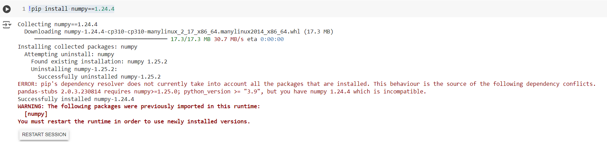
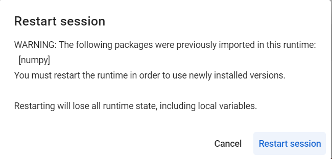

# 1. Vehicle Counting Repository Setup Guide
This notebook provides step-by-step instructions to set up and run the vehicle counting application on three different platforms: Google Colab, Jupyter Notebooks, and via Bash/Linux commands.
## 1.1. Google Colab
Follow these steps to set up and run the application in Google Colab.

### Step 1: Install NumPy
Run the following cell to install NumPy version 1.24.4.


```python
!pip install numpy==1.24.4
```

If you see a message like the following, click **RESTART SESSION** and then re-run the previous and upcoming cells.





### Step 2: Verify NumPy Installation
Run the following cell to ensure NumPy version 1.24.4 is installed.


```python
import numpy as np
print("NumPy Version:", np.__version__)
```

### Step 3: Clone Repository and Install Dependencies
Run the following cell to upgrade pip, setuptools, and wheel, clone the repository and install dependencies and finally .


```python
!pip install --upgrade pip setuptools wheel
!git clone https://github.com/hamzaelouiaazzani/vehicle_counting_CV.git  # clone repo
!pip install -e .
import torch
from IPython.display import Image, clear_output  # to display images

clear_output()
print(f"Setup complete. Using torch {torch.__version__} ({torch.cuda.get_device_properties(0).name if torch.cuda.is_available() else 'CPU'})")
```

### Step 4: Run counting: 

Import counting files:


```python
from counting.run_count import run
from counting.count import args
```

To print the documentation about the arguments:


```python
print(args.__doc__)
```

Change the arguments as you want:


```python
args.source = "kech.mp4"
args.name = "kech"
args.verbose = True
args.save_csv_count = True
```

Run the counting process:


```python
counter_yolo , profilers , results  = run(args)
```

if you prompt args.save to **True** please check the results saved in folder **\runs\count** that is going to be created.

- counter_yolo object is the object that stores everything about the detector, the tracking and the counting used algorithms.
- profilers: contains the time taken by each phase of the pipeline for the given video: **Pre-processing----> Detection----> Post-processing----> Tracking----> Counting**.
- results: contains the results of detection and tracking of diffrents objects of the video.

Extract informations:


```python
# video attribues:
counter_yolo.video_attributes
```


```python
# Counting Results
print(f"The number of vehicles counted by the algorithm is: {counter_yolo.counter}")
print(f"The number of vehicles per type counted by the algorithm is: {counter_yolo.count_per_class}")
```

## 1.2. Jupyter Notebooks
Follow these steps to set up and run the application in Jupyter Notebooks.

### Step 1: Create Virtual Environment (Bash/Anaconda Prompt)
Open a Bash or Anaconda Prompt and run the following commands to create and activate a virtual environment named `vehicle_counter`:
```bash
conda create --name vehicle_counter python=3.8
conda activate vehicle_counter
```

> **Note:** You can neglect the above two instructions if you don't want working in a virtual envirenement.

### Step 2: Upgrade pip and Install Dependencies
Download/clone the repository and run the following cell to upgrade pip, setuptools, and wheel, and install the repository dependencies.


```python
!pip install --upgrade pip setuptools wheel
!pip install -e .
```

> **Note:** Once you run this cell, comment it out and do not run it again because the packages are already installed in the environment.

### Step 3: Verify Torch Installation
Run the following cell to verify the installation of PyTorch and check if CUDA is available.


```python
import torch
if torch.cuda.is_available():
    torch.cuda.get_device_properties(0).name
torch.cuda.is_available()
```

### Step 4: Clear Output and Confirm Setup
Run the following cell to clear the output and confirm the setup.


```python
from IPython.display import Image, clear_output  # to display images

clear_output()
print(f"Setup complete. Using torch {torch.__version__} ({torch.cuda.get_device_properties(0).name if torch.cuda.is_available() else 'CPU'})")
```

### Step 5: Run counting

Import counting files:


```python
from counting.run_count import run
from counting.count import args
```

To print the documentation about the arguments:


```python
print(args.__doc__)
```

Change the arguments as you want:


```python
args.source = "kech.mp4"
args.name = "kech"
args.verbose = True
args.save_csv_count = True
```

Run the counting process:


```python
# Run the counting algorithm
counter_yolo , profilers , results  = run(args)
```

if you prompt args.save to **True** please check the results saved in folder **\runs\count** that is going to be created.

- counter_yolo: This object stores all information about the detector, tracking, and counting algorithms used.
- profilers: This object contains the time taken by each phase of the pipeline for the given video: **Pre-processing----> Detection----> Post-processing----> Tracking----> Counting**.
- results: This object contains the results of detection and tracking for different objects in the video.

Extract informations:


```python
# video attribues:
counter_yolo.video_attributes
```


```python
# Counting Results
print(f"The number of vehicles counted by the algorithm is: {counter_yolo.counter}")
print(f"The number of vehicles per type counted by the algorithm is: {counter_yolo.count_per_class}")
```

## 1.3. Bash/Linux Commands
Follow these steps to set up and run the application via Bash/Linux commands.

### Step 1: Create Virtual Environment
Open a terminal and run the following commands to create and activate a virtual environment named `vehicle_counter`:
```bash
python -m venv vehicle_counter
source vehicle_counter/bin/activate
```

### Step 2: Upgrade pip and Install Dependencies
Run the following commands to upgrade pip, setuptools, and wheel, and install the repository dependencies:
```bash
pip install --upgrade pip setuptools wheel
git clone https://github.com/hamzaelouiaazzani/vehicle_counting_CV.git  # clone repo
pip install -e .
```

### Step 3: Verify Torch Installation
Run the following commands to verify the installation of PyTorch and check if CUDA is available:
```bash
python -c "import torch; print(f'Setup complete. Using torch {torch.__version__} ({torch.cuda.get_device_properties(0).name if torch.cuda.is_available() else 'CPU'})')"
```

### Step 4: Run counting: 
Kindly before running the following counting script be sure you prompt your chosen **args** configuration within the demo.py file (remember you can edit your configuration as you want):
```bash
python3 counting/demo.py
```
If you prompt args.save to **True** please check the results saved in folder **\runs\count** that is going to be created.
